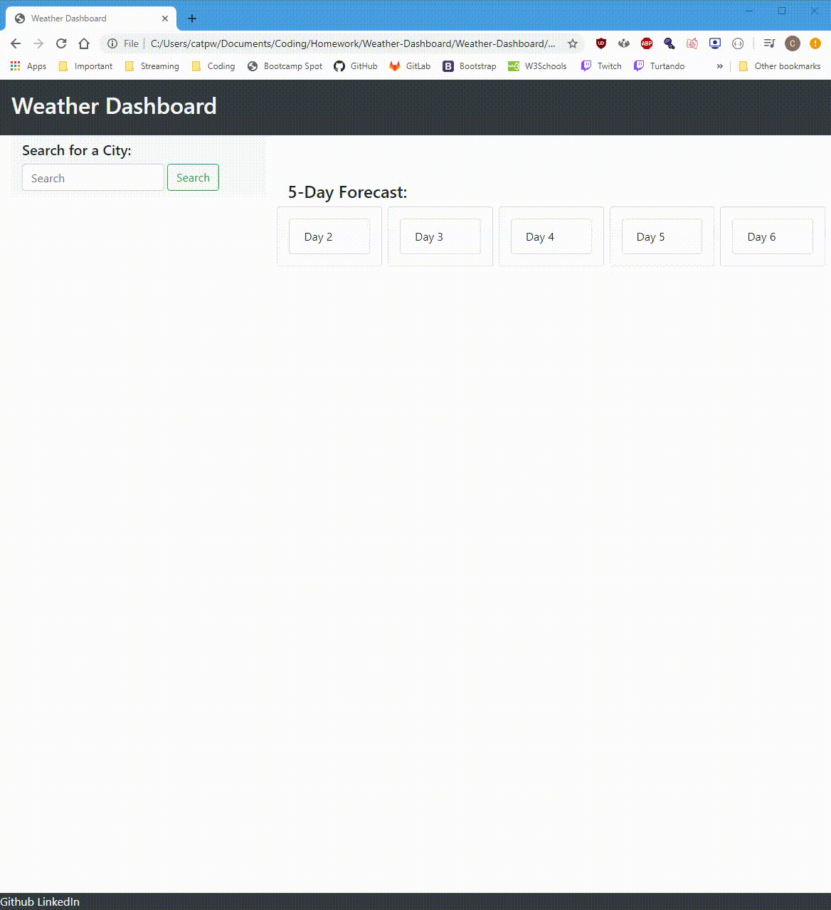

# Weather Dashboard
https://turtando.github.io/Weather-Dashboard/

# Description 
I have developed a live and functioning weather dashboard. In this particular project, my objectives and goals were to be able to create a viable weather gathering function that was to retrieve data from another API (application program interface). In this instance the data we are retrieving in this application is coming directly from the OpenWeatherMap API.

# Table of Contents 
* [Installation](#installation)
* [Usage](#usage)
* [License](#license)
* [Contributors](#contributors)
* [Test](#test)
* [Questions](#questions)
* [Contact](#contact)

# Installation
 
In this app specifically, the user will be able to generate a 5-day weather outlook for any city that they choose. When they enter the city into the search bar, they are presented with conditions that give the City Name and date of the time they are searching along with an icon that represents the current and future weather conditions, temperature, humidity percentage and wind speed.

# Usage

Even after a new city has been searched by the user, the searched cities will remain on a list under the search section- if the user clicks on any of the cities, her or she will be able to see that city's forecast.

Gif of Demo below:

# License

MIT

# Contributors

Christopher Turton

# Test

# Questions

For any additional questions in regards to this program or questions or suggestions, you may contact Christopher Turton at christopheraturton@gmail.com or directly on his Github at github.com/Turtando 

## Contact
*To contact the developer, you may reach them at https://github.com/Turtando on GitHub or, you email directly at christopheraturton@gmail.com.*

